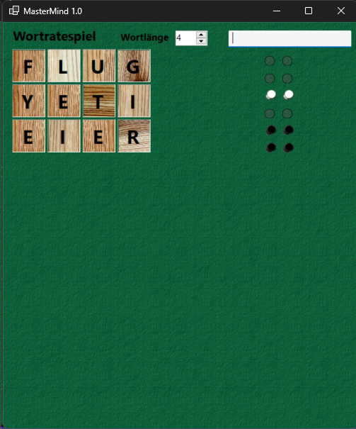
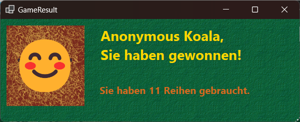
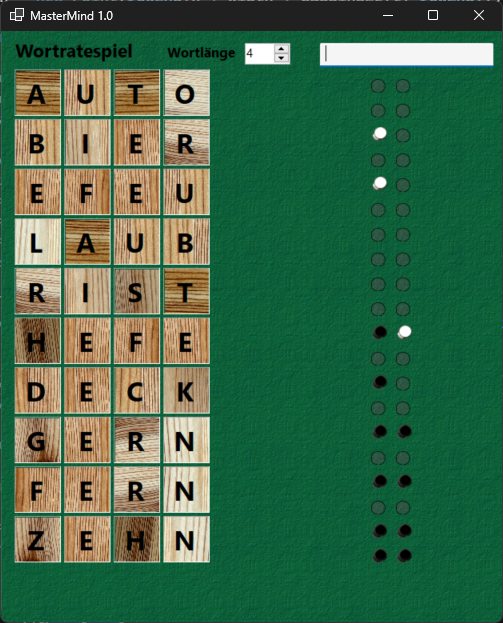
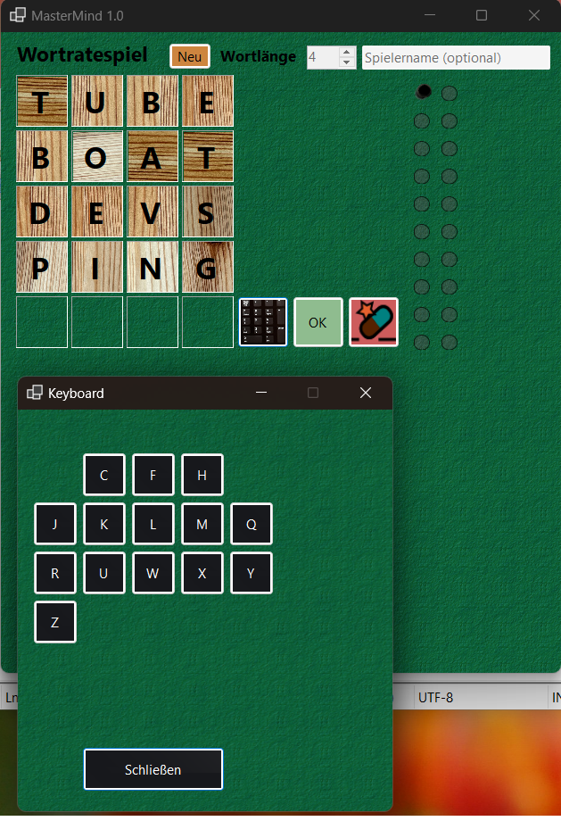
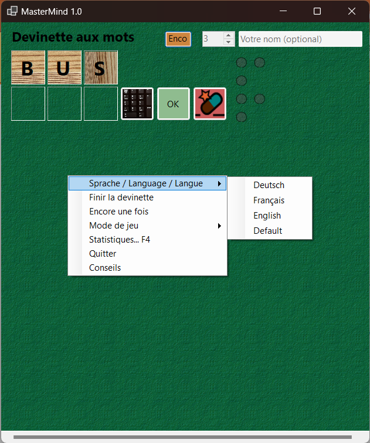
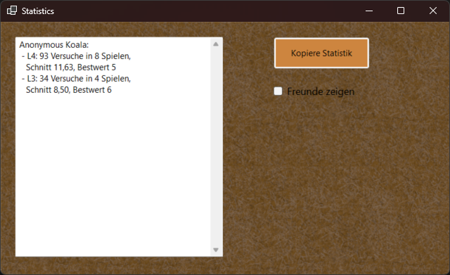

# Examples

<table><tr>
<td></td>
<td></td>
</tr>
<tr><td>Example 1&hellip;</td><td>&hellip; Won!</td></tr>
<tr><td></td>
<td></td>
</tr>
<tr><td>Example 2&hellip;</td><td>Getting tips: Letters reduced.</td></tr>
<tr><td></td>
<td></td>
</tr>
<tr><td>Also in French</td><td>Statistics view</td></tr>
</table>
